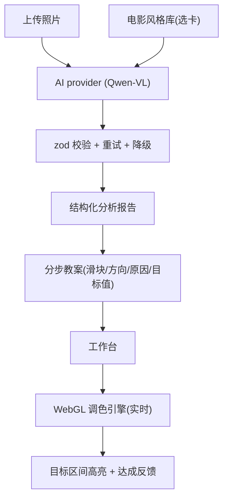

# CineCanvas — AI 辅助调色学习网站（MVP 原型）

## 定位与已确认决策

- **产品形态**：概念原型 / 作品集 Demo，前端为主，AI 接真实模型，不做复杂账号系统。
- **AI**：可切换 provider 接口，默认接国内多模态模型（Qwen-VL / DashScope），带 **schema 校验 + 重试 + 降级**。
- **两大功能**：(1) 照片分析→分步指导→实时调色；(2) 精选电影风格库，选卡后生成「靠近该风格」的分步教案。共用同一套工作台。
- **教学交互**：动手式——AI 告诉你调哪个滑块/方向/原因，滑块显示目标区间高亮，用户自己拖到目标区间获得「达成」反馈。
- **MVP 滑块**：10 个基础项；曲线 + HSL 分通道 = 二期「进阶模式」。
- **视觉**：沿用 Figma 拼贴/复古杂志风（胶片孔洞、撕纸、黑白半调、暗红主色、衬线艺术字）。

## 技术选型

- `React + Vite + TypeScript + TailwindCSS`
- 状态：`Zustand`
- 调色引擎：**PixiJS v8**（维护良好的 WebGL 运行时，替代已停维护的 glfx.js）
- AI 校验：`zod`
- 路由：`react-router`

## 调色引擎方案（单 shader，降低调试风险）

- **一个自定义 fragment shader 按正确顺序实现全部 10 项**；PixiJS v8 只当 WebGL 运行时（纹理、渲染、resize）。
- 放弃「ColorMatrixFilter + 自定义滤镜」的双 pass 拆分：10 项里 7 项（高光/阴影/白/黑/自然饱和度等）本就无法用线性矩阵实现，而双 pass 无法穿插操作顺序；单 pass 顺序可控、性能更好。
- 规避颜色科学隐蔽 bug 的方式：色温/色调、高光/阴影用**社区验证过的成熟公式**（亮度遮罩、R/B·G 增益），不自研黑体曲线。
- **色彩空间简化（MVP）**：全程在 sRGB/感知空间运算，白平衡增益也直接作用于 sRGB 编码值（与曝光/对比度一致），不引入 linear-light 管线；linear-light 留二期。
- shader 内操作顺序：白平衡(色温/色调) → 曝光 → 对比度 → 高光/阴影 → 白色/黑色 → 自然饱和度 → 饱和度。

## 图片预处理（大图性能）

- 上传后立即降采样：**工作台预览长边 2000px**，拖滑块才顺滑；不直接把 20MP+ 原图丢进实时渲染。
- **送 AI 分析的图更小（长边约 1280px）**，兼顾 vision 模型尺寸限制与成本。
- 保留原图 File 引用，供**二期全分辨率导出**用。

## 架构与数据流

## 目录结构（拟）

- `src/engine/` — `GradingCanvas.ts`（Pixi 应用+纹理管理）、`filters/`（ColorMatrix 组装 + 自定义 `colorScience.frag.glsl`）、`pipeline.ts`（10 滑块值→滤镜参数）
- `src/lib/` — `downsample.ts`（上传后按长边降采样，产出预览图与 AI 用小图）
- `src/ai/` — `provider.ts`（接口）、`qwenProvider.ts`、`schema.ts`（zod）、`analyzePhoto.ts`、`generateSteps.ts`、`withValidation.ts`（校验+重试+降级）
- `src/store/` — `useGradingStore.ts`（滑块值）、`useSessionStore.ts`（图片/报告/教案/当前步）
- `src/data/films.ts` — 精选电影风格卡：含参考剧照、标签、`targetAdjustments`（量化滑块目标值，与滑块同枚举同值域）
- `src/components/` — `UploadZone`、`AnalysisReport`、`Workspace`、`SliderPanel`、`Slider`（带目标区间高亮）、`StepCoach`、`FilmLibrary`、`FilmCard`
- `src/pages/` — `Home`（Select Your Film 拼贴入口）、`WorkspacePage`
- `src/theme/` — 拼贴风样式与素材

## AI 输出契约（结构化 JSON）

分析报告字段：`oneLineDiagnosis`、`strengths[]`、`issues[{title, locationHint}]`、`direction`、`steps[]`。
每个 step：`slider`(10 项枚举之一)、`direction`(+/-)、`targetRange {min,max}`、`reason`、`order`。
**校验策略**：zod 校验字段齐全 + 数值落在滑块合法域；失败→回传错误让模型修复重试（上限 2 次）→仍失败降级为纯文字建议并提示用户。

## 功能二教案生成（更稳定可控）

- 起点为中性（所有滑块=0），风格卡自带**量化目标值** `targetAdjustments`。
- AI 的职责是**结合当前照片实际情况微调这组目标值**（如照片本就偏暖则减少色温增量），并为每步给出原因，而不是「凭感觉编数值」。
- 因此 `films.ts` 的目标值必须与 steps 的 `slider` 枚举、`targetRange` 值域**完全对齐**，AI 做的是「当前值→目标值」的差异化解释，输出更稳定。

## 10 个基础滑块（MVP）

曝光、对比度、高光、阴影、白色、黑色、色温、色调、自然饱和度、饱和度 —— 全部实时渲染（分工见「调色引擎方案」）。

## 分期

- **一期(MVP)**：上传→分析报告→动手式分步工作台(10 滑块, 实时)→电影风格库→拼贴风 UI。
- **二期**：曲线 + HSL 分通道「进阶模式」、一键应用兜底、导出对比图、更多风格卡。

