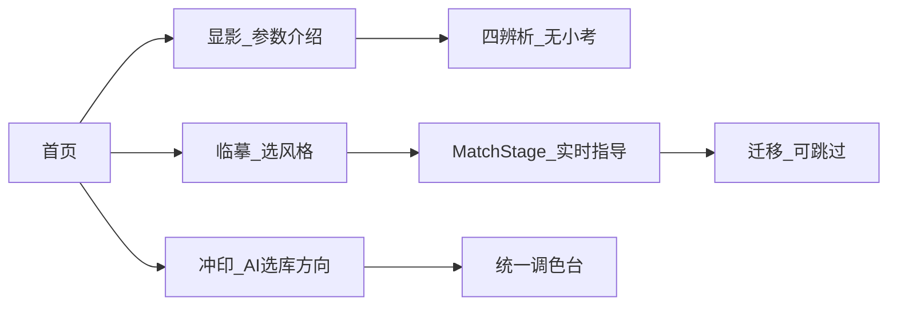

# CineCanvas · 当前真相

> 更新：2026-07-31  
> **只认这一份。** 旧 roadmap / P1 分步 / 过时 handoff / `.cursor/plans` 仅作历史，见下方链接。

## 产品主路径

首页是**唯一入口**；其它页面只回首页。

| 入口 | 路由 | 小字 |
|------|------|------|
| **显影** | `/learn/intro` | 先搞懂光是怎么变成一张有情绪的照片 |
| **临摹** | `/learn/styles` | 拿一张你喜欢的电影截图，学着调出那种味道 |
| **冲印** | 上传/分析 → 统一调色台 | 上传自己的照片，从头调一遍，调成你想要的样子 |

- **实验室取代工作台**：统一调色台（现 `/learn/lab`）；首页不出现「工作台」；`/workspace` 待合并或重定向。
- **曲线 / HSL**：本阶段不扩教学轨；曲线可留在调色台。
- **辨析关**：不设小考（介绍 → 自由拖 → 完成）。

## 当前实施计划

→ **[docs/plans/2026-07-31-slider-mastery-plan.md](./plans/2026-07-31-slider-mastery-plan.md)**

里程碑：M0 文档归位（本文件）→ M1 评分内核 → M2 MatchStage+CoachPack → M3 显影介绍页 → M4 风格库+临摹流 → M5 导航/统一调色台 → M6 冲印接审美库。

## 活跃交接

→ **[docs/handoff/2026-07-31-agent-slider-mastery.md](./handoff/2026-07-31-agent-slider-mastery.md)**

## 文档目录规范

| 路径 | 用途 |
|------|------|
| `docs/CURRENT.md` | **唯一当前真相**（本文件） |
| `docs/plans/` | 进行中的实施计划（带日期） |
| `docs/handoff/` | **仅一份** active 交接 |
| `docs/archive/` | 过时计划与旧交接 |
| `.cursor/rules/` | alwaysApply 铁律（引擎保护区等） |
| `.cursor/plans/` | 不放产品真相；见该目录 README |

会话里 Cursor 写到 `~/.cursor/plans/` 的计划，**必须同步进** `docs/plans/`，否则下一窗口在仓库里看不到。

## 引擎铁律

→ [`.cursor/rules/engine-protection.mdc`](../.cursor/rules/engine-protection.mdc)

## 历史（勿当当前计划）

- [archive/](./archive/) — 已归档的 `.cursor/plans` 与旧 handoff  
- [plans/2026-07-28-teaching-first-roadmap.md](./plans/2026-07-28-teaching-first-roadmap.md) — 顺序已调整，见文首说明  
- [plans/2026-07-29-p1-implementation-steps.md](./plans/2026-07-29-p1-implementation-steps.md) — 同上  
