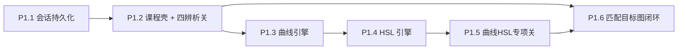

# P1 实施步骤规划

> Date: 2026-07-29  
> Parent: `[2026-07-28-teaching-first-roadmap.md](./2026-07-28-teaching-first-roadmap.md)`  
> Handoff: `[../handoff/2026-07-29-agent-teaching-p0-histogram.md](../handoff/2026-07-29-agent-teaching-p0-histogram.md)`

**Goal:** 在不碰现有 10 滑块数学的前提下，落地 A 组引擎扩展（曲线/HSL）+ 第一层辨析关卡 + 第二层匹配闭环；教学全部走 `/learn/`*。

**原则：** 每一步可独立验收、可 revert；先能教学、再加工具；关卡内容尽量不依赖 AI。

**已从范围剔除（勿加回）：** 影响区域可视化、差异热力图、直方图↔照片像素联动。

---

## 为什么要拆步

P1 原清单把「引擎扩展 + 四关卡 + 匹配闭环 + 持久化」捆在一起，一次做完风险高、难验收。按依赖切开后：

- 关卡 1/2/4/5 **只需要现有 10 滑块**，不必等曲线/HSL。
- 曲线/HSL 是专项关卡与匹配闭环「进阶配方」的前提。
- 会话持久化独立、投入小、立刻改善体验。

**已完成（不再列任务）：** 引擎响应门槛（原 P1.0）——`pipeline.ts` 映射已调到示教级手感。

---

## P1.1 · 会话持久化（半日级）

**做：**

- `useSessionStore`：persist 图片元数据策略要谨慎——`blob:` URL 刷新会失效
- 实用方案：persist 滑块 `useGradingStore` + `currentStepIndex` / 分析 JSON；图片仍需重新上传，或把 preview 存为 IndexedDB（若半日不够，**先只 persist 滑块 + 教案**，图片提示「刷新需重传」）
- 推荐默认：**persist 调色值 + analysis + stepIndex**；image 不 persist，UI 一句说明即可（避免 IndexedDB 复杂化拖慢 P1）

**验收：** 有教案时刷新，滑块与步骤还在；无图时引导回上传。

---

## P1.2 · 课程壳 + 第一层四关（最大教学切片，约 3–5 日）

**不依赖曲线/HSL。** 这是 P1 最该先交付的「能学到东西」的版本。

### 2a 课程壳

- 路由例如：`/learn` 目录、`/learn/lessons/:id`
- 关卡数据：`src/data/lessons/`（id、标题、诊断图路径、对比文案、A/B 题）
- 复用 `/learn/lab` 的画布 + 直方图 + before/after，不要复制引擎

### 2b 四关内容（定稿清单）

| 关   | 对比             | 诊断图要点     |
| --- | -------------- | --------- |
| L1  | 曝光 vs 白色 vs 高光 | 蓝天白云轻微过曝  |
| L2  | 阴影 vs 黑色       | 逆光/暗部有内容  |
| L4  | 自然饱和度 vs 饱和度   | 肤色 + 鲜艳背景 |
| L5  | 色温 vs 色调       | 明显偏色或双轴可辨 |

每关结构（固定，无 AI）：

1. 一句话「这两个参数哪里像、哪里不像」
2. 固定图 + 只开放相关滑块（或引导先拖 A 再拖 B）
3. 直方图 + before/after 对照
4. 结尾 A/B 辨认题（「哪张是曝光+50？哪张是白色+50？」）——答案由隐藏配方渲染，不靠模型

### 2c 教具

- 已有：直方图示波器、闪回
- **不做：** 影响区域伪彩色

**验收：** 四关可从头玩到通关；不打开 `/workspace` 也能学完机制层这四组。

**停点：** 你玩一遍四关，文案/手感 OK 再开引擎扩展。

---

## P1.3 · 曲线引擎（追加式，约 2–3 日）

**铁律：** 新 uniform / LUT 默认 identity；现有 10 项顺序与数学不动。

**做：**

- 控制点 → 单调三次样条 → 烘成 256×1 LUT 纹理
- shader 在影调之后、或约定位置 **查表**（写入 `grading.ts` 新 stage + 同步 `tonalMath.ts`）
- 先做**亮度曲线** UI（`/learn/lab` 或进阶面板）；RGB 分通道可同 PR 或紧随
- `verify:tonal` 增加：默认 LUT = 与扩展前逐像素一致；单调性抽检

**验收：** 全 0 曲线时与改前截图/哈希一致；拉 S 曲线对比度 visibly 变化。

---

## P1.4 · HSL 引擎（追加式，约 2–3 日）

**做：**

- 8 色相通道 × (H/S/L)，色相距离加权；默认 no-op
- 同步 tonalMath + verify
- `/learn` 下 HSL 面板（可先只暴露橙/黄/蓝三通道降低 UI 复杂度，数据模型仍 8 通道）

**验收：** 默认 no-op；减黄饱和可见「天蓝回来」类效果可手测。

---

## P1.5 · 曲线 / HSL 专项关（约 1–2 日）

在 P1.2 课程壳上加关，不新开产品形态：

| 关   | 知识点            |
| --- | -------------- |
| C1  | S 曲线 = 手动对比度   |
| C2  | 抬黑点 = 胶片褪色感    |
| H1  | 黄通道降饱和 ≈「减黄还蓝」 |
| H2  | 橙通道护肤（明度/饱和）   |

**验收：** 专项关可通关；仍无 AI。

---

## P1.6 · 匹配目标图闭环（约 3–4 日）

**依赖：** P1.2 的布局/路由经验；有曲线/HSL 后目标配方可以更丰富，但 **MVP 可用纯 10 滑块隐藏配方** 先上，进阶配方后补。

**做：**

- 页：`/learn/match/:id`
- 布局：横图上下叠 / 竖图左右分（短边方向规则）
- 视图：并排 | 闪回（复用 `BeforeAfterFlash` 思路：目标 vs 当前）
- 评分：降采样像素 L1/L2 或直方图 diff → 匹配度 %（**无热力图**）
- 完成后揭晓参考配方；AI 解说为可选（可先用静态文案对比「你的解 vs 参考解」）

**验收：** 横竖各一关可玩通；达到阈值显示成功；无热力图。

---

## 建议排期与停点

| 阶段       | 产出         | 你验收什么                 |
| -------- | ---------- | --------------------- |
| P1.1     | 刷新不丢滑块/教案  | 体验是否可接受               |
| **P1.2** | **四辨析关可玩** | **是否真的学到参数区别** ← 主里程碑 |
| P1.3–1.4 | 曲线+HSL     | no-op 回归 + 手感         |
| P1.5     | 专项关        | 「减黄还蓝」等是否讲清           |
| P1.6     | 匹配闭环       | 是否好玩、评分是否公道           |

若时间紧：**P1.2 → P1.6（10 滑块配方）** 可先闭环「机制+操作」；曲线/HSL（1.3–1.5）作为 P1b 紧随。

---

## 每阶段通用约束

1. 只改 `/learn/*` + 追加式引擎；禁止改现有 10 滑块数学 unless 任务明确是修 bug / 调映射。
2. 提交前：`npm run lint` && `npm run verify:tonal` && `npm run build`。
3. 改 shader 后浏览器硬刷新。
4. 每完成一个 P1.x **停下来等你验收**（与 P0 纪律相同）。
5. 不要做：影响区域可视化、差异热力图、TonalRangeOverlay。

---

## 文档同步清单

- [x] roadmap / 本文件：原 P1.0 引擎响应已完成并删除任务
- [x] handoff：下一步指向本文 P1.1→P1.6
- [ ] 关卡图资产：`public/learn/` 或 `src/assets/learn/`（需你或后续准备诊断图）

