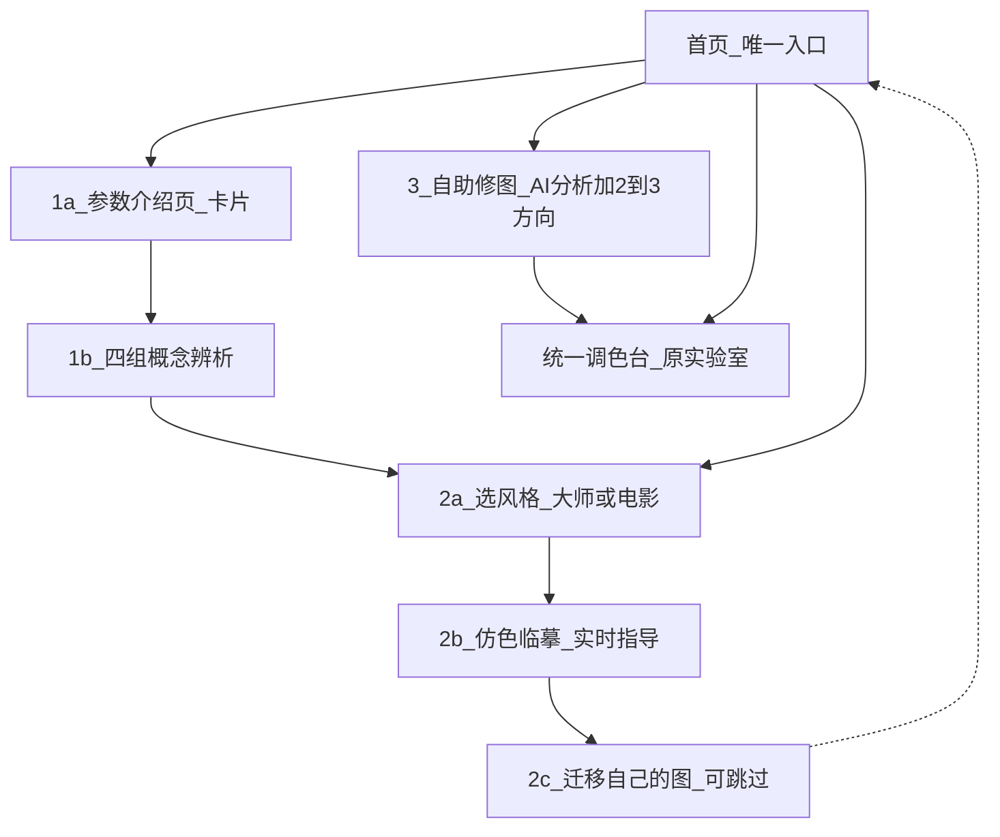
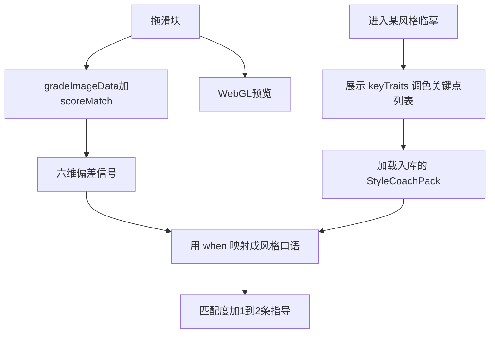
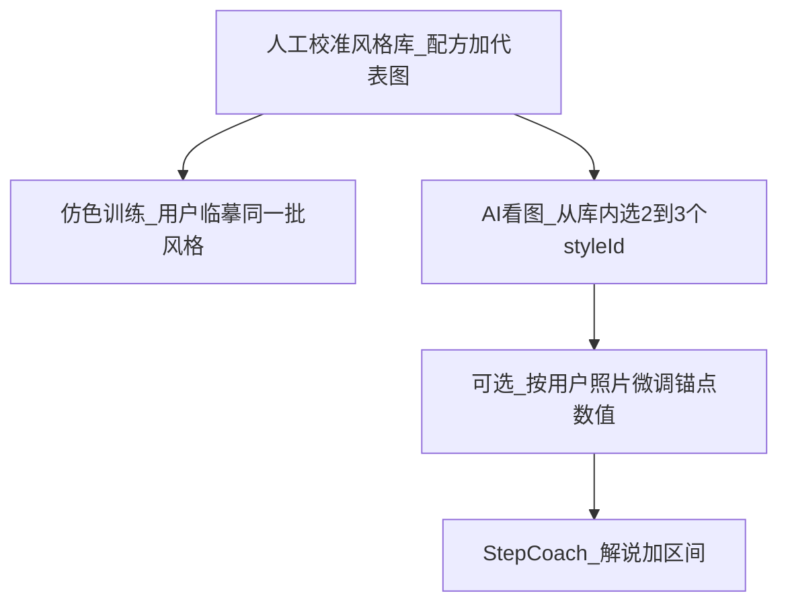
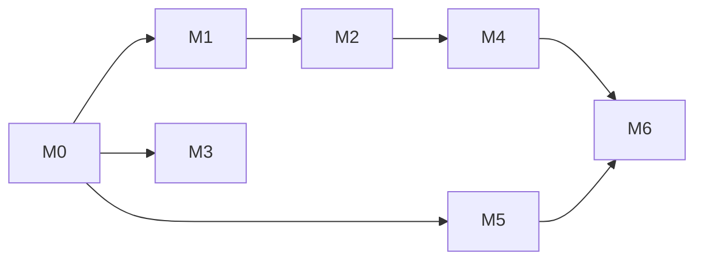
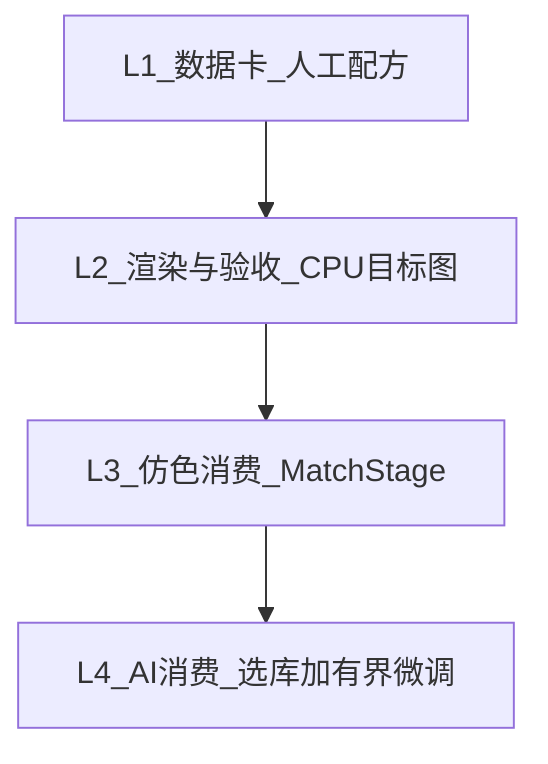

---
name: 滑块教学闭环
overview: 首页三入口「显影 / 临摹 / 冲印」。临摹用确定性评分 + 风格专属 CoachPack（人工 keyTraits 进关介绍 + when 实时文案）做差异化指导；冲印走上传流进统一调色台，方向来自同一审美库。
todos:
  - id: m0-docs-ia
    content: M0 文档归位 + CURRENT.md：首页文案显影/临摹/冲印、唯一入口、统一调色台、CoachPack 差异化指导、审美库联动
    status: completed
  - id: m1-grade-score
    content: M1 评分内核：gradeImageData + scoreMatch + diffHints + calibrate-match 阈值；不碰 shader
    status: pending
  - id: m2-match-stage
    content: M2 MatchStage：进关展示 keyTraits 列表 → 并排+闪回+实时匹配度；when 按风格映射六维偏差；达标解锁、揭晓配方
    status: pending
  - id: m3-param-intro
    content: M3 显影·参数介绍页 /learn/intro：10 滑块卡片式正文；再进四辨析；无小考
    status: pending
  - id: m4-style-match
    content: M4 临摹 /learn/styles：风格库+recipe+每卡人工 CoachPack（含 3~5 条 keyTraits，内容按片/风格单独写）→ MatchStage → 可选迁移；选片避开强依赖暗角
    status: pending
  - id: m5-unify-lab
    content: M5 首页三入口文案落地（显影/临摹/冲印）；冲印走上传分析流进统一调色台；/workspace 合并或重定向；非首页只回首页
    status: pending
  - id: m6-ai-taste-base
    content: M6 冲印：一次 AI 调用（照片+全库 blurb/keyTraits）选出 2–3 个合法 styleId；用户点选后 generateFilmSteps+±15 护栏；无标签打分
    status: pending
isProject: false
---

# 产品主路径重定 + 滑块教学闭环

## 1. 你指出的混乱：怎么收


| 问题                         | 决定                                                             |
| -------------------------- | -------------------------------------------------------------- |
| 实验室 vs 工作台功能重叠，实验室有曲线工作台没有 | **实验室取代工作台**为唯一调色台；首页不再单独入口「工作台」；`/workspace` 执行阶段合并进 lab 或重定向 |
| 页面交叉乱跳                     | **除首页外，所有页面只链回首页**；首页是进入一切功能的唯一入口                              |
| 仿色与电影风格拆成两条                | **合并为一条「仿色训练」**：选风格（含大师/电影代表图）→ 临摹 → 可选迁移                      |


---

## 2. 产品流程（三阶）




### 阶 1 · 显影（机制）

1. **参数介绍页**（`/learn/intro`）：10 滑块卡片正文（名称 / 管什么 / 和谁容易混）。
2. **四组概念辨析**：介绍 → 自由拖 → 完成本关。**不设小考**。

### 阶 2 · 临摹（仿色）

1. 预置风格库（大师 / 电影代表图 + 人工 recipe + **风格专属教练包**）
2. 用户选择 → 临摹（实时匹配度 + **按风格不同的指导文案**，见 §4）
3. 迁移到自己的照片（可跳过）

### 阶 3 · 冲印（自助修图）

1. 上传 → AI 分析
2. **2～3 种调色方向**（来自审美库）
3. 统一调色台里在指导下修完

侧门：统一调色台可无 AI 自由练。本阶段不做 HSL / 曲线教学轨 / 清晰度家族。

---

## 3. 首页入口文案（已定稿）

| 主文案 | 路由 | 小字 |
|--------|------|------|
| **显影** | `/learn/intro` | 先搞懂光是怎么变成一张有情绪的照片 |
| **临摹** | `/learn/styles` | 拿一张你喜欢的电影截图，学着调出那种味道 |
| **冲印** | 上传/分析流 → 统一调色台（现 `/analyze`→调色面；`/workspace` 合并或重定向，**首页不出现「工作台」字样**） | 上传自己的照片，从头调一遍，调成你想要的样子 |

导航铁律：

- 非首页页：**只显示「回首页」**
- `/learn/lab`：升级为冲印/自由练共用的统一调色台（路由可暂留）

---

## 4. 仿色实时反馈 + 与 AI / 风格联动

**结论：要联动，但不能「每拖一下打一次 AI」。**  
实时层保持确定性（快、稳、可校准）；风格差异用 **CoachPack**——进关用人工 **keyTraits**，拖动用 **when** 映射。



### 4.1 实时层（每帧 / debounce，无模型）

| 层 | 做法 |
|----|------|
| 预览 | WebGL 即时 |
| 目标图 | `recipe × 底图` 缓存一次 |
| 匹配度 | 像素 MAE → 0–100% |
| 偏差信号 | 六维：整体明暗 / 暗部 / 亮部 / 暖冷 / 绿品 / 饱和 |
| 节流 | 长边 ~192；debounce ~120ms |
| 过关 | 达阈值解锁；揭晓「你的解 vs 参考解」 |

### 4.2 风格层：StyleCoachPack

每张 `StyleCard` 带一份 Pack：

```ts
interface StyleCoachPack {
  styleId: string
  /** 这张卡的调色关键点，3~5 条；每张卡内容完全不同，禁止套模板填空 */
  keyTraits: string[]
  /** 六维信号 → 该风格专属口语；仍不点名滑块 */
  when: Partial<Record<HintDim, { tooLow: string; tooHigh: string }>>
  /** 本风格优先强调的维度（排序加权） */
  priorityDims?: HintDim[]
  milestones?: { at: number; line: string }[]
}
```

**`keyTraits`（进关介绍，有分量）：**

- 不是一句总览，而是这张风格/电影**最值得学的调色特征列表**
- 展示时机：用户进关、**尚未拖滑块**的介绍页
- **纯人工静态**写入数据卡（4 张卡手写 4 份）；**禁止**运行时 AI 生成，也禁止用同一套模板给每张卡填空
- 例 ·《爱乐之城》：高饱和度 / 强对比色（色相对撞、互补色）/ 高对比度 / 暗角  
- 换一张卡，列表内容必须按该片/该风格的真实调色逻辑重写

**`when`（拖动中实时指导）：**

- 同一套六维偏差信号，文案按风格查表  
- 冷调夜戏「暗部偏亮」→「夜戏的黑还不够沉」；褪色胶片同信号 →「黑场再抬才有尘封感」

### 4.3 已知缺口：暗角（建库时注意，本阶段不做引擎）

当前 **10 滑块**与 **6 个反馈维度**都**没有暗角（vignette）**。

- `keyTraits` 里可以写「暗角」作介绍性教学点（如爱乐之城）
- 但拖滑块阶段的实时反馈**识别不了、也调不了**暗角
- **选片/建库**：优先避开「强依赖暗角才成立」的片子；或接受关键点里有介绍、练习阶段无法练到该项
- 若以后要把暗角做成可调能力，另开评估（新滑块/新 pass），**现在不做**

### 4.4 AI 怎么接

| 时机 | 谁 | 做什么 |
|------|----|--------|
| 建库时 | **人**写 `keyTraits` + `when`（`when` 可离线草稿后人工改） | 进 git，零延迟 |
| 进临摹关 | 只读入库 Pack | **不**调用模型生成 keyTraits |
| 拖动中 | **禁止**调模型 | score + `when` 映射 |
| 冲印（阶 3） | AI | 选库方向 + StepCoach |

护栏：`when` / milestones 文案禁止点名滑块名；`priorityDims` 落在闭合枚举；`keyTraits` 长度 3–5。

### 4.5 工程落点

- M2：MatchStage 进关先渲染 `keyTraits` 列表，再进入拖滑块；`when` 用人工 Pack  
- M4：每卡手写完整 Pack 入库；选片遵守 §4.3 暗角约束  
- M6：冲印接审美库；**不做**「进关 AI 生成 CoachPack」

校准脚本只管分数阈值；`keyTraits` 靠抽查是否像「懂这张片的人列的要点」。

---

## 5. 技术卡点 2：AI 品味差、参数不合引擎——怎么办？

### 现状真相（仓库里已经暴露的问题）

- AI **不知道**引擎真实响应曲线。提示词只约束：滑块枚举、`-100..100`、`targetRange` 宽度、方向符号（见 `[src/ai/prompts.ts](src/ai/prompts.ts)`）。  
- **没有**注入 `pipeline.ts` 的曝光档位、对比度 sigmoid、软肩、中性≠identity 等。  
- 所以模型按「大众 Lightroom 直觉」报数，和本引擎手感错位——这是结构问题，不是偶发。  
- `generateFilmSteps` 的正确设计本意是：**人工 `targetAdjustments` 锚住**，AI 只做「按当前照片微调 + 写解说」；但风格卡 `films.ts` 从未落地，锚点缺失，AI 就在裸奔。

### 解法：第二层风格库 = 审美知识库（你提的联动，采纳为架构）




规则：

1. **品味不交给模型发明**——风格方向、代表图、基准配方由人校准（`/debug/compare` 过目、不发灰）。
2. **冲印「2～3 个方向」= AI 看图后从库内 `styleId` 中点名**（喂全库 `blurb`+`keyTraits`，见 §8.3 L4）；不能发明库外风格。
3. **数值以库内配方为锚**；选中后沿用 `generateFilmSteps` 做有界微调 + 写解说，禁止从零编整表。
4. **引擎说明书写进系统提示**（短版）：曝光 ±50≈±1.5 档、对比度 0=identity、禁止假设「中性=原图」等。
5. 长期可加：CPU 目标图验收「微调后是否仍接近锚点风格」。

这样：**临摹练审美库；冲印消费同一库**——AI 是「看图选库 + 解说」，不是「品味生成器」。
---

## 6. 实现里程碑（按依赖）


| 里程碑 | 产出                                       | 验收            |
| --- | ---------------------------------------- | ------------- |
| M0  | `docs/CURRENT.md` + 主计划入库 + 旧文档标取代；写清 IA | 打开 CURRENT 不晕 |
| M1  | `gradeImage` + `matchScore` + 校准脚本       | 对/错分数可分       |
| M2  | `MatchStage`                             | 实时指导手感        |
| M3  | 参数介绍页 + 辨析入口接上（辨析本身少改）                   | 卡片能认真读完再进辨析   |
| M4  | 风格库数据 + 仿色流（选→临摹→可跳过迁移）                  | 临摹能过关；迁移可跳过   |
| M5  | 实验室取代工作台；全站只回首页                          | 无工作台入口；无交叉跳   |
| M6  | 冲印单步 AI 选库（2–3 合法 styleId）+ 教案         | 方向来自库内 id，非法打回  |


停点：每里程碑后等你验收；M2/M4 阈值与文案尤其要你点头。

提交前：`npm run lint` && `npm run verify:tonal` && `npm run build`。

---

## 7. 各里程碑工程量与难度

难度：★ 低 / ★★ 中 / ★★★ 高。人天为单人熟悉本仓库的粗估（含你验收停点，不含扯皮版权素材的无限时间）。


| 里程碑               | 难度  | 人天    | 工程性质                                | 主要风险                                            |
| ----------------- | --- | ----- | ----------------------------------- | ----------------------------------------------- |
| **M0 文档+IA 规格**   | ★   | 0.5   | 写文档、归档、改 README 指向                  | 无；纯对齐                                           |
| **M1 评分内核**       | ★★  | 1.5–2 | 从 `histogram.ts` 抽循环；MAE+六统计量；校准脚本  | 阈值拍歪 → 手感崩；需你玩一遍校准表                             |
| **M2 MatchStage** | ★★  | 2–3   | 新页面壳+复用闪回/滑块/直方图；debounce 接线        | UI 信息密度；横竖图布局                                   |
| **M3 参数介绍页**      | ★   | 1–1.5 | 新路由+10 张卡片文案（可复用 `SLIDERS` hint 扩写） | 文案质量（产品/教学），代码简单                                |
| **M4 风格库+仿色流**    | ★★★ | 4–6   | **数据+校准+三步 UI**；依赖 M1/M2            | **最大瓶颈在内容**：代表图版权、配方手感、每张卡要 `/debug/compare` 过目 |
| **M5 统一调色台+导航**   | ★★  | 2–3   | 合并 Workspace 能力进 Lab；砍交叉链；重定向       | 状态串台（session/grading store）；AI 模式开关别弄乱          |
| **M6 AI 接审美库**    | ★★★ | 2–4   | 一次选库调用（全库介绍）+ zod 合法 id；再 generateFilmSteps | 选错片；微调漂出风格；**依赖 M4 至少 3–4 张卡** |


**依赖与总览**




- 可并行：M3（介绍页）∥ M1→M2；M5 可在 M4 中段开始（导航先收，AI 模式后接）。  
- **关键路径**：M1 → M2 → M4 → M6。没有风格库数据，M6 无法真落地。  
- **全量粗估**：约 **13–20 人天**；其中审美库内容校准占 M4 大半，不是纯码农工时。  
- **本阶段刻意不做**（避免膨胀）：HSL、曲线教学轨、向量检索/embedding、用户贡献风格、云端风格同步。

**难度排序（你该盯的）**

1. **M4 内容与配方**（难在审美与版权，不在 CRUD）
2. **M6 选库+微调不漂**（难在产品契约）
3. **M1/M2 阈值手感**（难在调参）
4. M5 合并（中等工程）
5. M0/M3（轻）

---

## 8. 审美知识库：技术实现路线（重点）

### 8.1 它是什么（一句话）

一个**版本化的 TypeScript 数据模块**（不是向量数据库、不是让 AI 记住品味）：每条 = 代表图 + 人工配方 + `blurb`/`keyTraits` 介绍 + 教学拆解。临摹与冲印**读同一份数据**。

### 8.2 数据模型（建议 `src/data/styles/types.ts`）

```ts
interface StyleCard {
  id: string
  name: string                    // 「冷调夜戏」「青橙大片感」或电影名
  kind: 'look' | 'film' | 'master'
  blurb: string                   // 一句话气质（冲印选库时整库喂给 AI）
  coverSrc: string                // 画廊封面（可与练习图相同）
  practiceImageSrc: string        // 仿色临摹底图
  /** 唯一数值真相：与 10 滑块同枚举同 -100..100 */
  recipe: Adjustments
  /** 临摹达标后揭晓 */
  breakdown: Array<{ slider: SliderId; why: string }>
  /** 临摹：keyTraits 进关介绍 + when 实时文案（见 §4.2）；keyTraits 纯人工 */
  coachPack: StyleCoachPack
}
```

MVP **不维护** `StyleTag` / `tags` / `fitWhen` 及标签打分（见 §8.3 L4；库扩到 20+ 再议粗筛）。

- **配方是 SSOT**；AI 不得覆盖整张表，只允许在适配阶段输出「delta 或微调后的副本」，且用 zod 限制单滑块偏离锚点上限（如 ±15）。  
- **CoachPack 与 recipe 同行**：换风格 = 换目标观感 + 换关键点列表 + 换指导语气。  
- MVP 先做 **4 张卡**（冲印侧按库 ≤10 张设计单步选库）；选片遵守 §4.3（暗角）；描述性 look 名可规避版权，电影/大师图有授权后再挂 `kind: 'film'|'master'`。
### 8.3 四层落地（按顺序，前一层稳了再做后一层）




**L1 · 建卡（内容工序，M4 前半）**

1. 选定气质 → 找/拍练习底图 → 放入 `public/styles/`
2. 在统一调色台或 `/debug/compare` **手调出目标观感**，记下 10 滑块，写入 `recipe`
3. 硬标准：`npm run verify:tonal` 仍绿；目视不发灰、不削高光死白
4. 写 `blurb`、`breakdown`、完整 `coachPack`（含 3~5 条 `keyTraits`）

**L2 · 渲染与机器验收（接 M1）**

1. `gradeImageData(practiceImage, recipe)` 生成目标 `ImageData`（或缓存预览 PNG 脚本）
2. 画廊 before/after 用同一路径，保证「你看见的目标 = 评分用的目标」
3. 校准脚本对每张卡跑：正确解高分、中性解低分、单滑块偏 ±20 中间分 → 写入该卡或全局阈值

**L3 · 仿色训练消费（M4 后半）**

- 列表读 `listStyles()` → 选卡 → MatchStage(`practiceImage`, `recipe`) → 达标揭晓 `breakdown` → 可选迁移（用户图 × 同一 `recipe`）

**L4 · 冲印 AI 消费（M6）——MVP 单步选库（库 ≤10 张）**

**为什么不用「标签诊断 → 代码打分」：** 封闭词表把照片压成几个关键词会丢掉光线质感、情绪、构图等整体感受；在 4 张卡规模下，标签机制解决的是「库太大塞不进一次对话」——问题尚未出现，不必提前牺牲判断精度。

**MVP 流程（诊断 + 选方向合并为一次 AI 调用）：**

| 步 | 谁做 | 输出 |
|----|------|------|
| A 选方向 | **一次 AI 调用** | 用户照片 + 风格库每张卡的完整介绍（`name` + `blurb` + `keyTraits`，**不是**只给 tags）→ 模型基于对照片的整体判断，从现有 `styleId` 中选出 **2～3** 个最适合的；可附短理由 |
| B 校验 | 代码 / zod | 输出的每个 id **必须属于当前风格库合法 ID 集合**；非法则打回重试。AI **不能发明**库外风格或新方向 |
| C 用户点选 | 用户 | 选一个 `styleId` |
| D 教案 | AI | 沿用 `generateFilmSteps`：锚点 `recipe` + 用户图 → 有界微调 + 写 `steps`/`reason` |
| E 护栏 | 代码 | zod：微调后每个滑块相对 recipe 偏离不超过 ADAPT_MAX（如 ±15）；步数与非零滑块来自锚点 |

**何时再加标签粗筛：** 风格库扩到 **约 20 张以上**、无法把全部卡的完整介绍塞进一次对话时，再引入「标签/规则粗筛候选 → AI 从候选精选」。现阶段（约 4 张）**不维护** `StyleTag`、`tags`、`fitWhen`、标签交集打分公式。

**引擎说明书**（短段落塞进选库 prompt / `buildFilmStylePrompt`）：曝光映射、对比度 0=identity、中性≠原图、影调勿当 RGB 加法。

### 8.4 固化风险：recipe 会不会把调色教死？

**会——如果教法把 recipe 当成唯一正确答案。**  
**不会——如果 recipe 只做「可复现的示范锚点」，验收看画面而不是看滑块。**


| 角色    | recipe 是什么                 | recipe 不是什么     |
| ----- | -------------------------- | --------------- |
| 仿色临摹  | 一张「目标观感」的可复现生成器（用来离线烘焙目标图） | 「必须拖到这些数字」的标准答案 |
| AI 自助 | 品味上限与方向锚（防大众味乱编）           | 每张用户照片的唯一解      |
| 教学叙事  | 「一种成立的拆法」                  | 「电影只能这样调」       |


**已定缓解（写进实现，勿做成滑块对答案）：**

1. **评分看像素/直方图差，不看滑块差值**——曝光+20≈白色+40 仍可过高分（殊途同归）。
2. **达标后揭晓对比**：「你的解 vs 参考解」并排滑块，文案写明参考只是一条路径。
3. **方向提示不点名滑块**——逼用户建立观感→操作的映射，而不是填空。
4. **迁移关（可跳过）**——同一气质换底图，锚点配方往往不能照抄，天然反固化。
5. **AI 适配有界微调**——按用户照片改锚点，不是贴同一组数字。
6. **统一调色台始终可自由练**——主路径示范，不封锁探索。

**后续可加（不阻塞 MVP）：** 同一气质 2 套参考配方（A/B look）；「开放题」关只给参考图、不给隐藏 recipe、只凭闪回自评。  

原则：**库约束的是 AI 的品味上限，不是用户的解法空间。**

### 8.5 明确不做的（防审美库做成大平台）

- MVP 不做 `StyleTag` / 标签打分 / `fitWhen`（库 >20 再议粗筛）  
- 不用向量数据库 / CLIP 图搜  
- 不让用户上传「自定义风格」进主库（污染 SSOT）  
- 不在 AI 里生成新 `recipe` 并写回库  
- 不把曲线点写进第一版 `recipe`（先 10 滑块；曲线留在调色台自由层）
### 8.6 和现有代码的接缝（复用，少造轮子）


| 已有                                           | 用法                                |
| -------------------------------------------- | --------------------------------- |
| `generateFilmSteps` + `buildFilmStylePrompt` | L4-D 几乎原样；输入改为 `StyleCard.recipe` |
| `Adjustments` / `SLIDER_IDS`                 | 配方类型                              |
| `gradePixelLinear` / 将抽出的 `gradeImageData`   | L2 目标图 + 仿色评分                     |
| `StepCoach` + `targetRange`                  | 自助修图指导 UI                         |
| `/debug/compare`                             | L1 人工校准目视                         |
| `MIN_GRADING_STEPS`                          | 卡入库前断言：`recipe` 非零滑块 ≥ 4          |


### 8.7 建议排期切片（审美库专用）

1. **先 1 张金丝雀卡**（look 类、自备图）跑通 L1→L3，证明 MatchStage+配方闭环
2. 扩到 **4 张** 再开 L4
3. L4：一次 AI 调用喂全库介绍 → zod 校验 `styleId` → 用户选 → `generateFilmSteps` + ±15 护栏
4. 有授权素材后再加 film/master 卡；选库契约不变（合法 id 集合随库增长）
---

## 9. 文档归位

**已执行（2026-07-31）：** 真相在仓库 `docs/CURRENT.md`；本文件在 `docs/plans/`；旧 handoff 与 `.cursor/plans` 已进 `docs/archive/`。

会话若再改计划，请同步改**本文件**，勿只改 `~/.cursor/plans/`。
